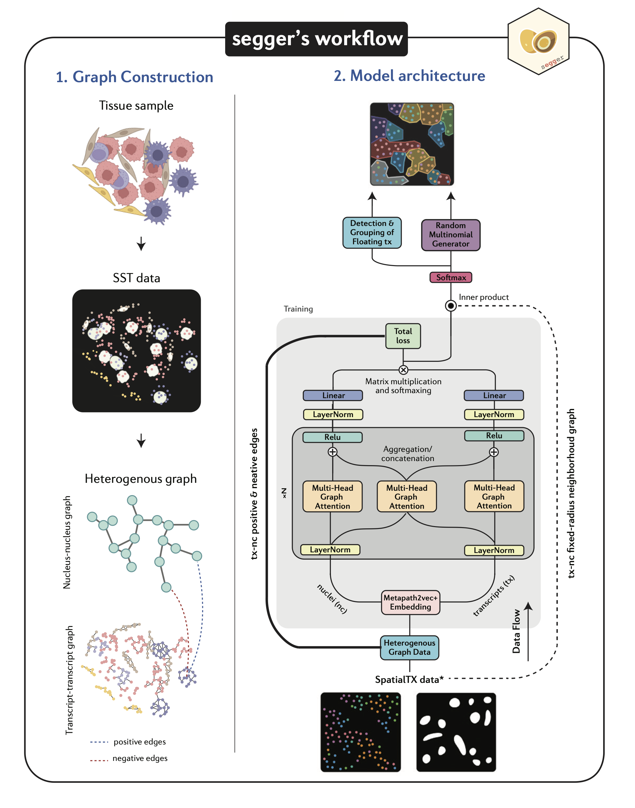

# 🍳 Welcome to segger!

[](https://results.pre-commit.ci/latest/github/EliHei2/segger_dev/main)

**Important note (Dec 2024)**: As segger is currently undergoing constant development, we highly recommend installing it directly via GitHub.

**segger** is a cutting-edge tool for **cell segmentation** in **single-molecule spatial omics** datasets. By leveraging **graph neural networks (GNNs)** and heterogeneous graphs, segger offers unmatched accuracy and scalability.

# How segger Works



---

# Quick Links

- 💾 **[Installation Guide](https://elihei2.github.io/segger_dev/installation/)**  
  Get started with installing segger on your machine.

- 📖 **[User Guide](https://elihei2.github.io/segger_dev/user_guide/)**  
  Learn how to use segger for cell segmentation tasks.

- 💻 **[Command-Line Interface (CLI)](https://elihei2.github.io/segger_dev/cli/)**  
  Explore the CLI options for working with segger.

- 📚 **[API Reference](https://elihei2.github.io/segger_dev/api/)**  
  Dive into the detailed API documentation for advanced usage.

- 📝 **[Sample Workflow](https://elihei2.github.io/segger_dev/notebooks/segger_tutorial/)**  
  Check out our tutorial showcasing a sample workflow with segger.

---

# Why segger?

- **Highly parallelizable** – Optimized for multi-GPU environments
- **Fast and efficient** – Trains in a fraction of the time compared to alternatives
- **Transfer learning** – Easily adaptable to new datasets and technologies

### Challenges in Segmentation

Spatial omics segmentation faces issues like:

- **Over/Under-segmentation**
- **Transcript contamination**
- **Scalability limitations**

segger tackles these with a **graph-based approach**, achieving superior segmentation accuracy.

---

## Installation

**Important note (Dec 2024)**: As segger is currently undergoing constant development, we highly recommend installing it directly via GitHub.

### GitHub Installation

For a straightforward local installation from GitHub, clone the repository and install the package using `pip`:

```bash
git clone https://github.com/EliHei2/segger_dev.git
cd segger_dev
pip install -e ".[cuda12]"
```

segger requires **CUDA 11** or **CUDA 12** for GPU acceleration.
You can find more detailed information in our **[Installation Guide](https://elihei2.github.io/segger_dev/installation/)**.
To avoid dependency conflicts, we recommend installing segger in a virtual environment or using a containerized environment.

### Docker Installation

We provide an easy-to-use Docker container for those who prefer a containerized environment. To pull and run the Docker image:

```bash
docker pull danielunyi42/segger_dev:cuda121
docker run --gpus all -it danielunyi42/segger_dev:cuda121
```

The official Docker image comes with all dependencies pre-installed, including the CUDA toolkit, PyTorch, and CuPy.
The current images support **CUDA 11.8** and **CUDA 12.1**, which can be specified in the image tag.

---

# Powered by

- **PyTorch Lightning & PyTorch Geometric**: Enables fast, efficient graph neural network (GNN) implementation for heterogeneous graphs.
- **Dask**: Scalable parallel processing and distributed task scheduling, ideal for handling large transcriptomic datasets.
- **Shapely & Geopandas**: Utilized for spatial operations such as polygon creation, scaling, and spatial relationship computations.
- **RAPIDS**: Provides GPU-accelerated computation for tasks like k-nearest neighbors (KNN) graph construction.
- **AnnData & Scanpy**: Efficient processing for single-cell datasets.
- **SciPy**: Facilitates spatial graph construction, including distance metrics and convex hull calculations for transcript clustering.

---

# Contributions

segger is **open-source** and welcomes contributions. Join us in advancing spatial omics segmentation!

- **Source Code**  
  [GitHub](https://github.com/EliHei2/segger_dev)

- **Bug Tracker**  
  [Report Issues](https://github.com/EliHei2/segger_dev/issues)

- **Full Documentation**  
  [API Reference](https://elihei2.github.io/segger_dev/api/)
