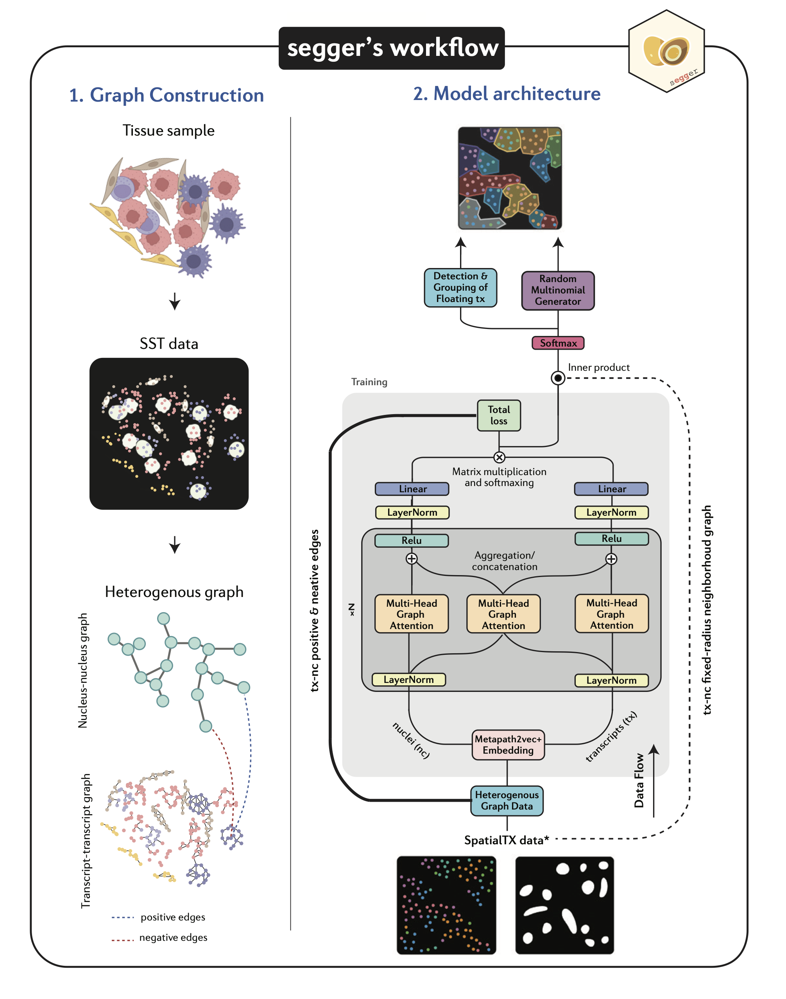

# :material-egg-fried: Welcome to segger 

**segger** is a cutting-edge tool for **cell segmentation** in **single-molecule spatial omics** datasets. By leveraging **graph neural networks (GNNs)** and heterogeneous graphs, segger offers unmatched accuracy and scalability.

---

# Quick Links

- :fontawesome-solid-download: **[Installation Guide](installation.md)**  
  Get started with installing segger on your machine.

- :material-book-open-page-variant: **[User Guide](user_guide/index.md)**  
  Learn how to use segger for cell segmentation tasks.

- :fontawesome-solid-terminal: **[Command-Line Interface (CLI)](cli.md)**  
  Explore the CLI options for working with segger.

- :material-code-tags: **[API Reference](api/index.md)**  
  Dive into the detailed API documentation for advanced usage.

---

# Why segger?

- :simple-dask: **Highly parallelizable**  – Optimized for multi-GPU environments
- :material-lightning-bolt-outline: **Fast and efficient** – Trains in a fraction of the time compared to alternatives
- :material-transfer: **Transfer learning** – Easily adaptable to new datasets and technologies

### **Challenges in Segmentation**

Spatial omics segmentation faces issues like:

- **Over/Under-segmentation**
- **Transcript contamination**
- **Scalability limitations**

segger tackles these with a **graph-based approach**, achieving superior segmentation accuracy.

---

# How segger Works

---

# Powered by

- :material-lightning-bolt-outline: **PyTorch Lightning & PyTorch Geometric**: Enables fast, efficient graph neural network (GNN) implementation for heterogeneous graphs.
- :simple-dask: **Dask**: Scalable parallel processing and distributed task scheduling, ideal for handling large transcriptomic datasets.
- :simple-geopandas: *Shapely & Geopandas*: Utilized for spatial operations such as polygon creation, scaling, and spatial relationship computations.
- :octicons-cpu-16: **RAPIDS**: Provides GPU-accelerated computation for tasks like k-nearest neighbors (KNN) graph construction.
- :material-table-multiple: **AnnData & Scanpy**: Efficient processing for single-cell datasets.
- :material-calculator: **SciPy**: Facilitates spatial graph construction, including distance metrics and convex hull calculations for transcript clustering.

---

# Contributions

segger is **open-source** and welcomes contributions. Join us in advancing spatial omics segmentation!

- :fontawesome-brands-github: **Source Code**  
  [GitHub](https://github.com/EliHei2/segger_dev)

- :material-bug-outline: **Bug Tracker**  
  [Report Issues](https://github.com/EliHei2/segger_dev/issues)

- :material-code-tags-check: **Full Documentation**  
  [API Reference](api/index.md)

